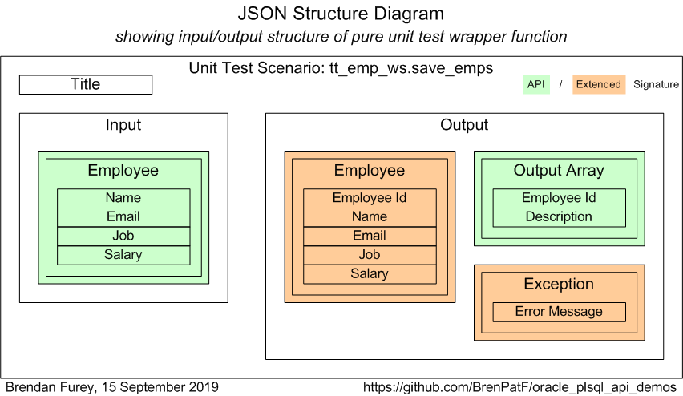
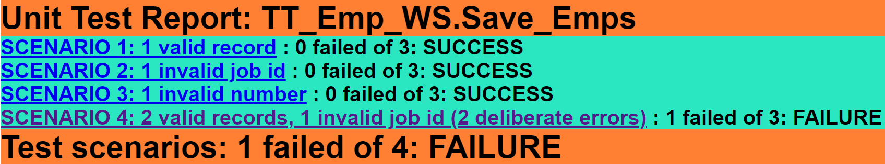
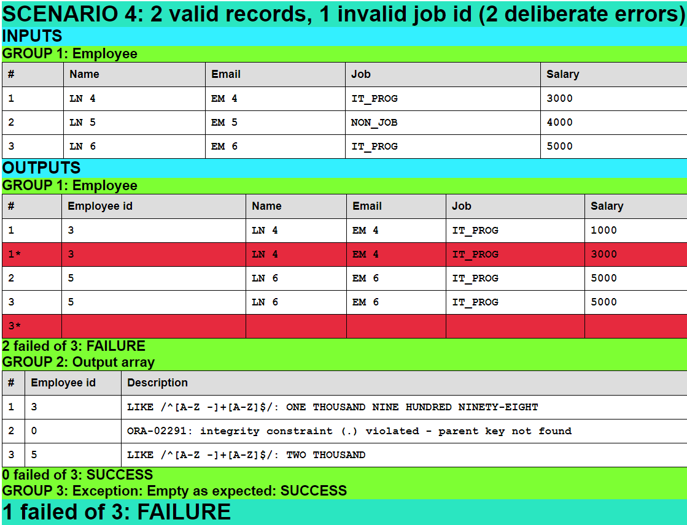

# Oracle PL/SQL API Demos
Module demonstrating instrumentation and logging, code timing and unit testing of Oracle PL/SQL APIs.

PL/SQL procedures were written against Oracle's HR demo schema to represent the different kinds of API across two axes: Setter/Getter and Real Time/Batch.

Mode          | Setter Example (S)          | Getter Example (G)
--------------|-----------------------------|----------------------------------
Real Time (R) | Web service saving          | Web service getting by ref cursor
Batch (B)     | Batch loading of flat files | View

The PL/SQL procedures and view were written originally to demonstrate unit testing, and are as follows:

- RS: Emp_WS.Save_Emps - Save a list of new employees to database, returning list of ids with Julian dates; logging errors to err$ table
- RG: Emp_WS.Get_Dept_Emps - For given department id, return department and employee details including salary ratios, excluding employees with job 'AD_ASST', and returning none if global salary total < 1600, via ref cursor
- BS: Emp_Batch.Load_Emps - Load new/updated employees from file via external table
- BG: hr_test_view_v - View returning department and employee details including salary ratios, excluding employees with job 'AD_ASST', and returning none if global salary total < 1600

Each of these is unit tested, as described below, and in addition there is a driver script, api_driver.sql, that calls each of them and lists the results of logging and code timing.

I presented on <a href="https://www.slideshare.net/brendanfurey7/clean-coding-in-plsql-and-sql" target="_blank" rel="noopener noreferrer">Writing Clean Code in PL/SQL and SQL</a> at the Ireland Oracle User Group Conference on 4 April 2019 in Dublin. The modules demonstrated here are written in the style recommended in the presentation where, in particular: 

- 'functional' code is preferred
- object-oriented code is used only where necessary, using a package record array approach, rather than type bodies
- record types, defaults and overloading used extensively to provide clean API interfaces 

## Screen Recordings on this Module
### 1 Overview (6 recordings – 48m) [Links live]
- [1.1 Introduction (5m)](https://reccloud.com/u/5usavxh)
- [1.2 Unit testing (13m)](https://reccloud.com/u/mkgxioc)
- [1.3 Logging and instrumentation (8m)](https://reccloud.com/u/pwaretg)
- [1.4 Code timing (6m)](https://reccloud.com/u/hzi79ra)
- [1.5 Functional PL/SQL I - pure functions; record types; separation of pure and impure (8m)](https://reccloud.com/u/jieo803)
- [1.6 Functional PL/SQL II - refactoring for purity (8m)](https://reccloud.com/u/y364pek)
### 2 Prerequisite Tools (1 recording – 3m) [Links NOT live]
- [2.1 Prerequisite tools (3m)]()
### 3 Installation (3 recordings – 15m) [Links NOT live]
- [3.1 Clone git repository (2m)]()
- [3.2 Install prerequisite modules (7m)]()
- [3.3 Install API demo components (6m)]()
### 4 Running the scripts (4 recordings – 26m) [Links NOT live]
- [4.1 Run unit tests (7m)]()
- [4.2 Review test results (8m)]()
- [4.3 Run API driver (9m)]()
- [4.4 Review API driver output (7m)]()

## Unit Testing
The PL/SQL APIs are tested using the Math Function Unit Testing design pattern, with test results in HTML and text format included. The design pattern is based on the idea that all API testing programs can follow a universal design pattern, using the concept of a ‘pure’ function as a wrapper to manage the ‘impurity’ inherent in database APIs. I explained the concepts involved in a presentation at the Ireland Oracle User Group Conference in March 2018:

<a href="https://www.slideshare.net/brendanfurey7/database-api-viewed-as-a-mathematical-function-insights-into-testing" target="_blank">The Database API Viewed As A Mathematical Function: Insights into Testing</a>

In this data-driven design pattern a driver program reads a set of scenarios from a JSON file, and loops over the scenarios calling the wrapper function with the scenario as input and obtaining the results as the return value. Utility functions from the Trapit module convert the input JSON into PL/SQL arrays, and, conversely, the output arrays into JSON text that is written to an output JSON file. This latter file contains all the input values and output values (expected and actual), as well as metadata describing the input and output groups. A separate nodejs module can be run to process the output files and create HTML files showing the results: Each unit test (say `pkg.prc`) has its own root page `pkg.prc.html` with links to a page for each scenario, located within a subfolder `pkg.prc`. Here, they have been copied into a subfolder test_output, as follows:

- tt_emp_batch.load_emps
- tt_emp_ws.get_dept_emps
- tt_emp_ws.save_emps
- tt_view_drivers.hr_test_view_v

Where the actual output record matches expected, just one is represented, while if the actual differs it is listed below the expected and with background colour red. The employee group in scenario 4 of tt_emp_ws.save_emps has two records deliberately not matching, the first by changing the expected salary and the second by adding a duplicate expected record.

Each of the `pkg.prc` subfolders also includes a JSON Structure Diagram, `pkg.prc.png`, showing the input/output structure of the pure unit test wrapper function. For example:


Running a test causes the actual values to be inserted to the JSON object, which is then formatted as HTML pages:

<div>

</div>

Here is the output JSON for the 4'th scenario of the corresponding test:

    "2 valid records, 1 invalid job id (2 deliberate errors)":{
       "inp":{
          "Employee":[
             "LN 4|EM 4|IT_PROG|3000",
             "LN 5|EM 5|NON_JOB|4000",
             "LN 6|EM 6|IT_PROG|5000"
          ]
       },
       "out":{
          "Employee":{
             "exp":[
                "3|LN 4|EM 4|IT_PROG|1000",
                "5|LN 6|EM 6|IT_PROG|5000",
                "5|LN 6|EM 6|IT_PROG|5000"
             ],
             "act":[
                "3|LN 4|EM 4|IT_PROG|3000",
                "5|LN 6|EM 6|IT_PROG|5000"
             ]
          },
          "Output array":{
             "exp":[
                "3|LIKE /^[A-Z -]+[A-Z]$/",
                "0|ORA-02291: integrity constraint (.) violated - parent key not found",
                "5|LIKE /^[A-Z -]+[A-Z]$/"
             ],
             "act":[
                "3|ONE THOUSAND NINE HUNDRED NINETY-EIGHT",
                "0|ORA-02291: integrity constraint (.) violated - parent key not found",
                "5|TWO THOUSAND"
             ]
          },
          "Exception":{
             "exp":[
             ],
             "act":[
             ]
          }
       }
    }

Here are images of the unit test summary and 4'th scenario pages for the corresponding test:





## Logging and Instrumentation
Program instrumentation means including lines of code to monitor the execution of a program, such as tracing lines covered, numbers of records processed, and timing information. Logging means storing such information, in database tables or elsewhere.

The Log_Set module allows for logging of various data in a lines table linked to a header for a given log, with the logging level configurable at runtime. The module also uses Oracle's DBMS_Application_Info API to allow for logging in memory only with information accessible via the V$SESSION and V$SESSION_LONGOPS views.

The two web service-type APIs, Emp_WS.Save_Emps and Emp_WS.Get_Dept_Emps, use a configuration that logs only via DBMS_Application_Info, while the batch API, Emp_Batch.Load_Emps, also logs to the tables. The view of course does not do any logging itself but calling programs can log the results of querying it.

The driver script api_driver.sql calls all four of the demo APIs and performs its own logging of the calls and the results returned, including the DBMS_Application_Info on exit. The driver logs using a special DEBUG configuration where the log is constructed implicitly by the first Put, and there is no need to pass a log identifier when putting (so debug lines can be easily added in any called package). At the end of the script queries are run that list the contents of the logs created during the session in creation order, first normal logs, then a listing for error logs (of which one is created by deliberately raising an exception handled in WHEN OTHERS).


Here, for example, is the text logged by the driver script for the first call:

    Call Emp_WS.Save_Emps to save a list of employees passed...
    ===========================================================
    DBMS_Application_Info: Module = EMP_WS: Log id 127
    ...................... Action = Log id 127 closed at 12-Sep-2019 06:20:2
    ...................... Client Info = Exit: Save_Emps, 2 inserted
    Print the records returned...
    =============================
    1862 - ONE THOUSAND EIGHT HUNDRED SIXTY-TWO
    1863 - ONE THOUSAND EIGHT HUNDRED SIXTY-THREE

## Code Timing
The code timing module Timer_Set is used by the driver script, api_driver.sql, to time the various calls, and at the end of the main block the results are logged using Log_Set.


 The timing results are listed for illustration below:

    Timer Set: api_driver, Constructed at 12 Sep 2019 06:20:28, written at 06:20:29
    ===============================================================================
    Timer             Elapsed         CPU       Calls       Ela/Call       CPU/Call
    -------------  ----------  ----------  ----------  -------------  -------------
    Save_Emps            0.00        0.00           1        0.00100        0.00000
    Get_Dept_Emps        0.00        0.00           1        0.00100        0.00000
    Write_File           0.00        0.02           1        0.00300        0.02000
    Load_Emps            0.22        0.15           1        0.22200        0.15000
    Delete_File          0.00        0.00           1        0.00200        0.00000
    View_To_List         0.00        0.00           1        0.00200        0.00000
    (Other)              0.00        0.00           1        0.00000        0.00000
    -------------  ----------  ----------  ----------  -------------  -------------
    Total                0.23        0.17           7        0.03300        0.02429
    -------------  ----------  ----------  ----------  -------------  -------------
    [Timer timed (per call in ms): Elapsed: 0.00794, CPU: 0.00873]

## Installation
### Install 1: Install pre-requisite tools
#### Oracle database with HR demo schema
The database installation requires a minimum Oracle version of 12.2, with Oracle's HR demo schema installed [Oracle Database Software Downloads](https://www.oracle.com/database/technologies/oracle-database-software-downloads.html).

If HR demo schema is not installed, it can be got from here: [Oracle Database Sample Schemas](https://docs.oracle.com/cd/E11882_01/server.112/e10831/installation.htm#COMSC001).

#### Github Desktop
In order to clone the code as a git repository you need to have the git application installed. I recommend [Github Desktop](https://desktop.github.com/) UI for managing repositories on windows. This depends on the git application, available here: [git downloads](https://git-scm.com/downloads), but can also be installed from within Github Desktop, according to these instructions: 
[How to install GitHub Desktop](https://www.techrepublic.com/article/how-to-install-github-desktop/).

#### nodejs (Javascript backend)
nodejs is needed to run a program that turns the unit test output files into formatted HTML pages. It requires no javascript knowledge to run the program, and nodejs can be installed [here](https://nodejs.org/en/download/).

### Install 2: Clone git repository
The following steps will download the repository into a folder, oracle_plsql_api_demos, within your GitHub root folder:
- Open Github desktop and click [File/Clone repository...]
- Paste into the url field on the URL tab: https://github.com/BrenPatF/oracle_plsql_api_demos.git
- Choose local path as folder where you want your GitHub root to be
- Click [Clone]

### Install 3: Install pre-requisite modules
The demo install depends on the pre-requisite modules Utils, Trapit, Log_Set, and Timer_Set, and `lib` and `app` schemas refer to the schemas in which Utils and examples are installed, respectively.

The pre-requisite modules can be installed by following the instructions for each module at the module root pages listed in the `See also` section below. This allows inclusion of the examples and unit tests for those modules. Alternatively, the next section shows how to install these modules directly without their examples or unit tests here.

#### [Schema: sys; Folder: install_prereq] Create lib and app schemas and Oracle directory
- install_sys.sql creates an Oracle directory, `input_dir`, pointing to 'c:\input'. Update this if necessary to a folder on the database server with read/write access for the Oracle OS user
- Run script from slqplus:
```
SQL> @install_sys
```
#### [Schema: lib; Folder: install_prereq\lib] Create lib components
- Run script from slqplus:
```
SQL> @install_lib_all
```
#### [Schema: app; Folder: install_prereq\app] Create app synonyms
- Run script from slqplus:
```
SQL> @c_syns_all
```
#### [Folder: (npm root)] Install npm trapit package
The npm trapit package is a nodejs package used to format unit test results as HTML pages.

Open a DOS or Powershell window in the folder where you want to install npm packages, and, with [nodejs](https://nodejs.org/en/download/) installed, run
```
$ npm install trapit
```
This should install the trapit nodejs package in a subfolder .\node_modules\trapit

### Install 4: Create Oracle PL/SQL API Demos components
#### [Folder: (root)]
- Copy the following files from the root folder to the server folder pointed to by the Oracle directory INPUT_DIR:
    - tt_emp_ws.save_emps_inp.json
    - tt_emp_ws.get_dept_emps_inp.json
    - tt_emp_batch.load_emps_inp.json
    - tt_view_drivers.hr_test_view_v_inp.json

- There is also a bash script to do this, assuming C:\input as INPUT_DIR:
```
$ ./cp_json_to_input.sh
```

#### [Schema: lib; Folder: lib]
- Run script from slqplus:
```
SQL> @install_jobs app
```
#### [Schema: hr; Folder: hr]
- Run script from slqplus:
```
SQL> @install_hr app
```
#### [Schema: app; Folder: app]
- Run script from slqplus:
```
SQL> @install_api_demos lib
```

## Running Driver Script and Unit Tests
### Running driver script
#### [Schema: app; Folder: app]
- Run script from slqplus:
```
SQL> @api_driver
```
The output is in api_driver.log

### Running unit tests
#### [Schema: app; Folder: app]
- Run script from slqplus:
```
SQL> @r_tests
```
Testing is data-driven from the input JSON objects that are loaded from files into the table tt_units (at install time), and produces JSON output files in the INPUT_DIR folder, that contain arrays of expected and actual records by group and scenario. These files are:

- tt_emp_batch.load_emps_out.json
- tt_emp_ws.get_dept_emps_out.json
- tt_emp_ws.save_emps_out.json
- tt_view_drivers.hr_test_view_v_out.json

The output files are processed by a nodejs program that has to be installed separately, from the `npm` nodejs repository, as described in the Installation section above. The nodejs program produces listings of the results in HTML and/or text format, and result files are included in the subfolders below test_output. To run the processor (in Windows), open a DOS or Powershell window in the trapit package folder after placing the output JSON files in the subfolder ./examples/externals and run:

```
$ node ./examples/externals/test-externals
```

## Operating System/Oracle Versions
### Windows
Tested on Windows 10, should be OS-independent
### Oracle
- Tested on Oracle Database Version 19.3.0.0.0 (minimum required: 12.2)

## See also
- [Utils - Oracle PL/SQL general utilities module](https://github.com/BrenPatF/oracle_plsql_utils)
- [Trapit - Oracle PL/SQL unit testing module](https://github.com/BrenPatF/trapit_oracle_tester)
- [Log_Set - Oracle logging module](https://github.com/BrenPatF/log_set_oracle)
- [Timer_Set - Oracle PL/SQL code timing module](https://github.com/BrenPatF/timer_set_oracle)
- [Trapit - nodejs unit test processing package](https://github.com/BrenPatF/trapit_nodejs_tester)

## License
MIT
