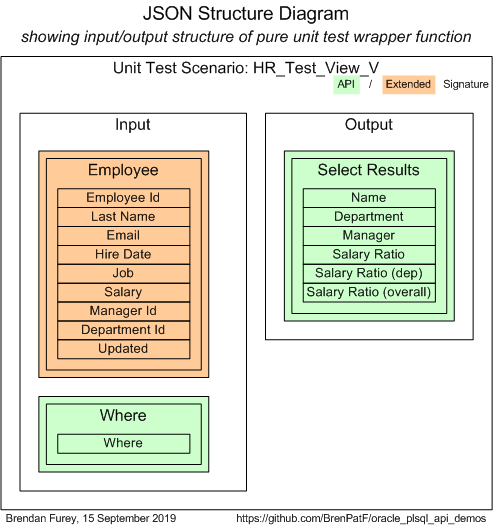

# Oracle PL/SQL API Demos / Unit Testing for API: HR_Test_View_V

Oracle PL/SQL API Demos is a module demonstrating instrumentation and logging, code timing and unit testing of Oracle PL/SQL APIs.
- [&uarr; README: Oracle PL/SQL API Demos](https://github.com/BrenPatF/oracle_plsql_api_demos#oracle_plsql_api_demos)

This README covers unit testing for one of the four demo APIs, namely the view HR_Test_View_V, using the Math Function Unit Testing design pattern, described here: [Trapit - Oracle PL/SQL unit testing module](https://github.com/BrenPatF/trapit_oracle_tester).

## In this README...
- [Unit Testing Process](https://github.com/BrenPatF/oracle_plsql_api_demos/blob/master/testing/hr_test_view_v/README.md#unit-testing-process)
- [Wrapper Function Signature Diagram](https://github.com/BrenPatF/oracle_plsql_api_demos/blob/master/testing/hr_test_view_v/README.md#wrapper-function-signature-diagram)
- [Unit Test Scenarios](https://github.com/BrenPatF/oracle_plsql_api_demos/blob/master/testing/hr_test_view_v/README.md#unit-test-scenarios)

## Unit Testing Process
- [&uarr; In this README...](https://github.com/BrenPatF/oracle_plsql_api_demos/blob/master/testing/hr_test_view_v/README.md#in-this-readme)

In the Math Function Unit Testing design pattern, a 'pure' wrapper function is constructed that takes all inputs as a parameter, calls the unit under test, and returns the outputs as a single complex value. The driving unit test program is centralized in a library package that calls the specific wrapper function using dynamic SQL (in languages such as Javascript the wrapper would be a callback function), within a loop over scenario records read from a JSON file. The driver writes an output file that contains arrays of expected and actual records by group and scenario in a JSON format. This file is processed by a nodejs program that produces listings of the results in HTML and/or text format.

The view, the `unit under test`, has a corresponding unit test wrapper function within a package, with both in the app schema/folder:
- `View`: HR_Test_View_V
- `Wrapper function`: TT_View_Drivers.Purely_Wrap_HR_Test_View_V

The input JSON file is created by the developer and placed in the Oracle directory `INPUT_DIR`, where the output file is also written. They have been copied here to the `testing\hr_test_view_v` folders:
- `Input JSON`: input\tt_view_drivers.purely_wrap_hr_test_view_v_inp.json 
- `Output JSON`: output\tt_view_drivers.purely_wrap_hr_test_view_v_out.json

An easy way to generate a starting point for the input JSON file is to use a powershell utility [Powershell Utilites module](https://github.com/BrenPatF/powershell_utils) to generate a template file with a single scenario with placeholder records from simple CSV files. The files for this example are in folder `testing\hr_test_view_v\input`:
- `Input CSV`: purely_wrap_hr_test_view_v_inp.csv
- `Output CSV`: purely_wrap_hr_test_view_v_out.csv
- `Powershell script`: purely_wrap_hr_test_view_v.ps1
- `Template JSON`: purely_wrap_hr_test_view_v_temp.json

The results folder generated by the nodejs program has been copied to the `testing\hr_test_view_v\output` folder:
- `Results folder`: oracle-pl_sql-api-demos_-tt_view_drivers.hr_test_view_v

## Wrapper Function Signature Diagram
- [&uarr; In this README...](https://github.com/BrenPatF/oracle_plsql_api_demos/blob/master/testing/hr_test_view_v/README.md#in-this-readme)

In the Math Function Unit Testing design pattern the wrapper function includes all inputs and outputs in its signature, including those that are accessed by the `unit under test` through means other than parameters or return value, such as via tables. The inputs and outputs are arranged in groups of records of fixed structure as shown in the diagram, with groups that form part of the `extended` signature in brown. This group structure is reflected in the structure of the input JSON file.

## Unit Test Scenarios
- [&uarr; In this README...](https://github.com/BrenPatF/oracle_plsql_api_demos/blob/master/testing/hr_test_view_v/README.md#in-this-readme)
- [Input Data Category Sets](https://github.com/BrenPatF/oracle_plsql_api_demos/blob/master/testing/hr_test_view_v/README.md#input-data-category-sets)
- [Scenario Results](https://github.com/BrenPatF/oracle_plsql_api_demos/blob/master/testing/hr_test_view_v/README.md#scenario-results)

The art of unit testing lies in choosing a set of scenarios that will produce a high degree of confidence in the functioning of the unit under test across the often very large range of possible inputs.

A useful approach to this can be to think in terms of categories of inputs, where we reduce large ranges to representative categories. In our case we might consider the following category sets, and create scenarios accordingly:

### Input Data Category Sets
- [&uarr; Unit Test Scenarios](https://github.com/BrenPatF/oracle_plsql_api_demos/blob/master/testing/hr_test_view_v/README.md#unit-test-scenarios)
- [Where Condition](https://github.com/BrenPatF/oracle_plsql_api_demos/blob/master/testing/hr_test_view_v/README.md#where-condition)
- [Joins](https://github.com/BrenPatF/oracle_plsql_api_demos/blob/master/testing/hr_test_view_v/README.md#joins)
- [Constraints](https://github.com/BrenPatF/oracle_plsql_api_demos/blob/master/testing/hr_test_view_v/README.md#constraints)
- [Expressions](https://github.com/BrenPatF/oracle_plsql_api_demos/blob/master/testing/hr_test_view_v/README.md#expressions)

#### Where Condition
- [&uarr; Input Data Category Sets](https://github.com/BrenPatF/oracle_plsql_api_demos/blob/master/testing/hr_test_view_v/README.md#input-data-category-sets)

Check 'where' condition handled correctly
- No condition
- Equality condition

#### Joins
- [&uarr; Input Data Category Sets](https://github.com/BrenPatF/oracle_plsql_api_demos/blob/master/testing/hr_test_view_v/README.md#input-data-category-sets)

Check that both inner and outer joins exclude or include records as appropriate
- Inner (department) excludes employees without matching department
- Outer (manager) includes employees without matching manager

#### Constraints
- [&uarr; Input Data Category Sets](https://github.com/BrenPatF/oracle_plsql_api_demos/blob/master/testing/hr_test_view_v/README.md#input-data-category-sets)

Check that constraints exclude records correctly
- Exclude job 'AD_ASST'
- Exclude where salary ratio overall < 1600

#### Expressions
- [&uarr; Input Data Category Sets](https://github.com/BrenPatF/oracle_plsql_api_demos/blob/master/testing/hr_test_view_v/README.md#input-data-category-sets)

Check that analytic and other expressions are calculated correctly
- Salary ratio by department
- Salary ratio overall

### Scenario Results
- [&uarr; Unit Test Scenarios](https://github.com/BrenPatF/oracle_plsql_api_demos/blob/master/testing/hr_test_view_v/README.md#unit-test-scenarios)
- [Results Summary](https://github.com/BrenPatF/oracle_plsql_api_demos/blob/master/testing/hr_test_view_v/README.md#results-summary)
- [Results for Scenario 1: DS-1, testing inner, outer joins, analytic over dep, and global ratios with 1 dep](https://github.com/BrenPatF/oracle_plsql_api_demos/blob/master/testing/hr_test_view_v/README.md#results-for-scenario-1-DS-1--testing-inner--outer-joins--analytic-over-dep--and-global-ratios-with-1-dep)

#### Results Summary
- [&uarr; Scenario Results](https://github.com/BrenPatF/oracle_plsql_api_demos/blob/master/testing/hr_test_view_v/README.md#scenario-results)

The summary report in text format shows the scenarios tested:

<pre>
Unit Test Report: Oracle PL/SQL API Demos: TT_View_Drivers.HR_Test_View_V
=========================================================================

      #    Scenario                                                                           Fails (of 1)  Status 
      ---  ---------------------------------------------------------------------------------  ------------  -------
      1    DS-1, testing inner, outer joins, analytic over dep, and global ratios with 1 dep  0             SUCCESS
      2    DS-2, testing same as 1 but with extra emp in another dep                          0             SUCCESS
      3    DS-2, passing 'WHERE dep=10'                                                       0             SUCCESS
      4    DS-3, Salaries total 1500 (< threshold of 1600, so return nothing)                 0             SUCCESS

Test scenarios: 0 failed of 4: SUCCESS
======================================
</pre>

You can review the formatted unit test results here, [Unit Test Report: Oracle PL/SQL API Demos: TT_View_Drivers.Purely_Wrap_HR_Test_View_V](http://htmlpreview.github.io/?https://github.com/BrenPatF/oracle_plsql_api_demos/blob/master/testing/hr_test_view_v/output/oracle-pl_sql-api-demos_-tt_view_drivers.hr_test_view_v/oracle-pl_sql-api-demos_-tt_view_drivers.hr_test_view_v.html), and the files are available in the `testing\hr_test_view_v\output\oracle-pl_sql-api-demos_-tt_view_drivers.hr_test_view_v` subfolder :
- `HTML root page`: oracle-pl_sql-api-demos_-tt_view_drivers.hr_test_view_v.html
- `Text file`: oracle-pl_sql-api-demos_-tt_view_drivers.hr_test_view_v.txt

#### Results for Scenario 1: DS-1, testing inner, outer joins, analytic over dep, and global ratios with 1 dep
- [&uarr; Scenario Results](https://github.com/BrenPatF/oracle_plsql_api_demos/blob/master/testing/hr_test_view_v/README.md#scenario-results)

<pre>
SCENARIO 1: DS-1, testing inner, outer joins, analytic over dep, and global ratios with 1 dep {
===============================================================================================

   INPUTS
   ======

      GROUP 1: Employee {
      ===================

            #  Employee Id  Last Name  Email  Hire Date    Job      Salary  Manager Id  Department Id  Updated    
            -  -----------  ---------  -----  -----------  -------  ------  ----------  -------------  -----------
            1  2618         LN_1       EM_1   17-JUN-2018  IT_PROG  1000                10             17-JUN-2018
            2  2619         LN_2       EM_2   17-JUN-2018  IT_PROG  2000    2618        10             17-JUN-2018
            3  2620         LN_3       EM_3   17-JUN-2018  IT_PROG  3000    2618                       17-JUN-2018
            4  2621         LN_4       EM_4   17-JUN-2018  AD_ASST  4000    2618        10             17-JUN-2018

      }
      =

      GROUP 2: Where {
      ================

            #  Where
            -  -----
            1       

      }
      =

   OUTPUTS
   =======

      GROUP 1: Select results {
      =========================

            #  Name  Department      Manager  Salary  Salary Ratio (dep)  Salary Ratio (overall)
            -  ----  --------------  -------  ------  ------------------  ----------------------
            1  LN_1  Administration           1000    .67                 .4                    
            2  LN_2  Administration  LN_1     2000    1.33                .8                    

      } 0 failed of 2: SUCCESS
      ========================

} 0 failed of 1: SUCCESS
========================
</pre>
