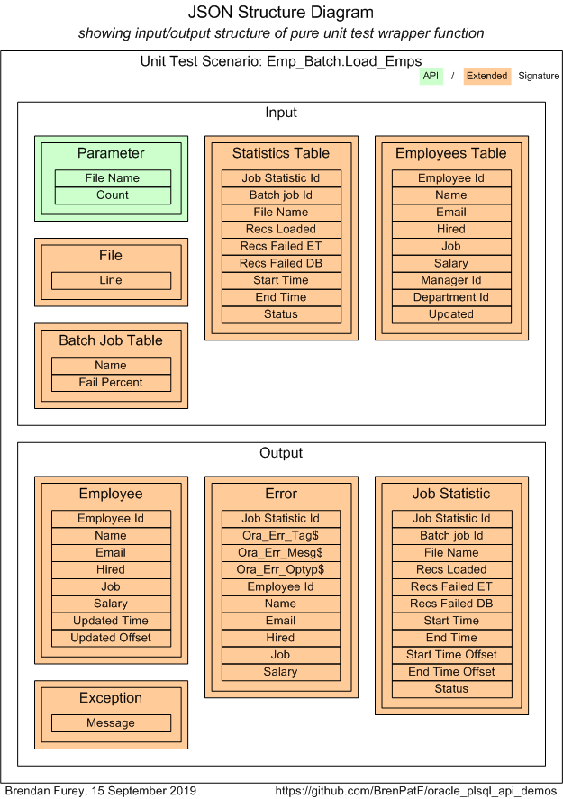

# Oracle PL/SQL API Demos / Unit Testing for API: Emp_Batch.Load_Emps

Oracle PL/SQL API Demos is a module demonstrating instrumentation and logging, code timing and unit testing of Oracle PL/SQL APIs.
- [&uarr; README: Oracle PL/SQL API Demos](https://github.com/BrenPatF/oracle_plsql_api_demos#oracle-plsql-api-demos)

This README covers unit testing for one of the four demo APIs, namely Emp_Batch.Load_Emps, using the Math Function Unit Testing design pattern, described here: [Trapit - Oracle PL/SQL unit testing module](https://github.com/BrenPatF/trapit_oracle_tester).

## In this README...
- [Unit Testing Process](https://github.com/BrenPatF/oracle_plsql_api_demos/blob/master/testing/load_emps/README.md#unit-testing-process)
- [Wrapper Function Signature Diagram](https://github.com/BrenPatF/oracle_plsql_api_demos/blob/master/testing/load_emps/README.md#wrapper-function-signature-diagram)
- [Unit Test Scenarios](https://github.com/BrenPatF/oracle_plsql_api_demos/blob/master/testing/load_emps/README.md#unit-test-scenarios)

## Unit Testing Process
- [&uarr; In this README...](https://github.com/BrenPatF/oracle_plsql_api_demos/blob/master/testing/load_emps/README.md#in-this-readme)

In the Math Function Unit Testing design pattern, a 'pure' wrapper function is constructed that takes all inputs as a parameter, calls the unit under test, and returns the outputs as a single complex value. The driving unit test program is centralized in a library package that calls the specific wrapper function using dynamic SQL (in languages such as Javascript the wrapper would be a callback function), within a loop over scenario records read from a JSON file. The driver writes an output file that contains arrays of expected and actual records by group and scenario in a JSON format. This file is processed by a nodejs program that produces listings of the results in HTML and/or text format.

The base procedure, the `unit under test`, has a corresponding unit test wrapper function, both within packages in the app schema/folder:
- `Base procedure`: Emp_Batch.Load_Emps
- `Wrapper function`: TT_Emp_Batch.Purely_Wrap_Load_Emps

The input JSON file is created by the developer and placed in the Oracle directory `INPUT_DIR`, where the output file is also written. They have been copied here to the `testing\load_emps` folders:
- `Input JSON`: input\tt_emp_batch.purely_wrap_load_emps_inp.json 
- `Output JSON`: output\tt_emp_batch.purely_wrap_load_emps_out.json

An easy way to generate a starting point for the input JSON file is to use a powershell utility [Powershell Utilites module](https://github.com/BrenPatF/powershell_utils) to generate a template file with a single scenario with placeholder records from simple CSV files. The files for this example are in folder `testing\load_emps\input`:
- `Input CSV`: purely_wrap_load_emps_inp.csv
- `Output CSV`: purely_wrap_load_emps_out.csv
- `Powershell script`: purely_wrap_load_emps.ps1
- `Template JSON`: purely_wrap_load_emps_temp.json

The results folder generated by the nodejs program has been copied to the `testing\load_emps\output` folder:
- `Results folder`: oracle-pl_sql-api-demos_-tt_emp_batch.load_emps

## Wrapper Function Signature Diagram
- [&uarr; In this README...](https://github.com/BrenPatF/oracle_plsql_api_demos/blob/master/testing/load_emps/README.md#in-this-readme)

In the Math Function Unit Testing design pattern the wrapper function includes all inputs and outputs in its signature, including those that are accessed by the `unit under test` through means other than parameters or return value, such as via tables. The inputs and outputs are arranged in groups of records of fixed structure as shown in the diagram, with groups that form part of the `extended` signature in brown. This group structure is reflected in the structure of the input JSON file.

## Unit Test Scenarios
- [&uarr; In this README...](https://github.com/BrenPatF/oracle_plsql_api_demos/blob/master/testing/load_emps/README.md#in-this-readme)
- [Input Data Category Sets](https://github.com/BrenPatF/oracle_plsql_api_demos/blob/master/testing/load_emps/README.md#input-data-category-sets)
- [Scenario Results](https://github.com/BrenPatF/oracle_plsql_api_demos/blob/master/testing/load_emps/README.md#scenario-results)

The art of unit testing lies in choosing a set of scenarios that will produce a high degree of confidence in the functioning of the unit under test across the often very large range of possible inputs.

A useful approach to this can be to think in terms of categories of inputs, where we reduce large ranges to representative categories. In our case we might consider the following category sets, and create scenarios accordingly:

### Input Data Category Sets
- [&uarr; Unit Test Scenarios](https://github.com/BrenPatF/oracle_plsql_api_demos/blob/master/testing/load_emps/README.md#unit-test-scenarios)
- [Valid Type](https://github.com/BrenPatF/oracle_plsql_api_demos/blob/master/testing/load_emps/README.md#valid-type)
- [Invalidity Type](https://github.com/BrenPatF/oracle_plsql_api_demos/blob/master/testing/load_emps/README.md#invalidity-type)
- [Exception](https://github.com/BrenPatF/oracle_plsql_api_demos/blob/master/testing/load_emps/README.md#exception)
- [Fail Threshold](https://github.com/BrenPatF/oracle_plsql_api_demos/blob/master/testing/load_emps/README.md#fail-threshold)
- [Multiplicity](https://github.com/BrenPatF/oracle_plsql_api_demos/blob/master/testing/load_emps/README.md#multiplicity)
- [Output Table](https://github.com/BrenPatF/oracle_plsql_api_demos/blob/master/testing/load_emps/README.md#output-table)
- [File Processed Status](https://github.com/BrenPatF/oracle_plsql_api_demos/blob/master/testing/load_emps/README.md#file-processed-status)
- [Record Counts](https://github.com/BrenPatF/oracle_plsql_api_demos/blob/master/testing/load_emps/README.md#record-counts)

#### Valid Type
- [&uarr; Input Data Category Sets](https://github.com/BrenPatF/oracle_plsql_api_demos/blob/master/testing/load_emps/README.md#input-data-category-sets)

Check different types of employee record are handled correctly
- New valid employee
- Old valid employee (no change)
- Old valid employee (changed)

#### Invalidity Type
- [&uarr; Input Data Category Sets](https://github.com/BrenPatF/oracle_plsql_api_demos/blob/master/testing/load_emps/README.md#input-data-category-sets)

Check different types of invalid employee record are handled correctly
- UID invalid
- Email too long
- Name too long
- Invalid job
- Invalid for external table loading

#### Exception
- [&uarr; Input Data Category Sets](https://github.com/BrenPatF/oracle_plsql_api_demos/blob/master/testing/load_emps/README.md#input-data-category-sets)

Check exceptions handled correctly
- No exception
- Exception for number of error records
- Exception for file already processed

#### Fail Threshold
- [&uarr; Input Data Category Sets](https://github.com/BrenPatF/oracle_plsql_api_demos/blob/master/testing/load_emps/README.md#input-data-category-sets)

Check exception raised when number of records in error as percentage of total exceeds threshold, and not otherwise
- % records in error below threshold
- % records in error above threshold

#### Multiplicity
- [&uarr; Input Data Category Sets](https://github.com/BrenPatF/oracle_plsql_api_demos/blob/master/testing/load_emps/README.md#input-data-category-sets)

Check varying record multiplicities handled correctly
- 1 valid employee
- Multiple valid employee
- Both valid and invalid employees

#### Output Table
- [&uarr; Input Data Category Sets](https://github.com/BrenPatF/oracle_plsql_api_demos/blob/master/testing/load_emps/README.md#input-data-category-sets)

Check each output table
- employees
- errors
- job_statistics

#### File Processed Status
- [&uarr; Input Data Category Sets](https://github.com/BrenPatF/oracle_plsql_api_demos/blob/master/testing/load_emps/README.md#input-data-category-sets)

Check file processed status handled correctly
- Not processed
- Failed (reprocess)
- Succeeded (exception)

#### Record Counts
- [&uarr; Input Data Category Sets](https://github.com/BrenPatF/oracle_plsql_api_demos/blob/master/testing/load_emps/README.md#input-data-category-sets)

Check record processing counts correct
- Loaded
- Failed ET (external table)
- Failed DB (database)

### Scenario Results
- [&uarr; Unit Test Scenarios](https://github.com/BrenPatF/oracle_plsql_api_demos/blob/master/testing/load_emps/README.md#unit-test-scenarios)
- [Results Summary](https://github.com/BrenPatF/oracle_plsql_api_demos/blob/master/testing/load_emps/README.md#results-summary)
- [Results for Scenario 1: NV/OV/OU/NI/OI/EI: 1/0/0/0/0/0. Existing J/E: 0/0. [1 valid new record from scratch]](https://github.com/BrenPatF/oracle_plsql_api_demos/blob/master/testing/load_emps/README.md#NV-OV-OU-NI-OI-EI--1-0-0-0-0-0--Existing-J-E--0-0---1-valid-new-record-from-scratch-)

#### Results Summary
- [&uarr; Scenario Results](https://github.com/BrenPatF/oracle_plsql_api_demos/blob/master/testing/load_emps/README.md#scenario-results)

The summary report in text format shows the scenarios tested:

<pre>
Unit Test Report: Oracle PL/SQL API Demos: TT_Emp_Batch.Load_Emps
=================================================================

      #    Scenario                                                                                                                                                        Fails (of 4)  Status 
      ---  --------------------------------------------------------------------------------------------------------------------------------------------------------------  ------------  -------
      1    NV/OV/OU/NI/OI/EI: 1/0/0/0/0/0. Existing J/E: 0/0. [1 valid new record from scratch]                                                                            0             SUCCESS
      2    NV/OV/OU/NI/OI/EI: 1/1/1/0/0/0. Existing J/E: 1/0. [3 valid records of each kind]                                                                               0             SUCCESS
      3    NV/OV/OU/NI/OI/EI: 0/0/0/0/1/0. Existing J/E: 1/1. Uid not found [1 invalid old - exception]                                                                    0             SUCCESS
      4    NV/OV/OU/NI/OI/EI: 0/0/0/1/0/0. Existing J/E: 1/1. Email too long [1 invalid new - exception]                                                                   0             SUCCESS
      5    NV/OV/OU/NI/OI/EI: 1/0/0/0/1/0. Existing J/E: 1/1. Name too long [1 valid new, 1 invalid old - no exception]                                                    0             SUCCESS
      6    NV/OV/OU/NI/OI/EI: 0/0/0/1/0/0. Existing J/E: 1/1. Invalid job [1 invalid new - exception]                                                                      0             SUCCESS
      7    NV/OV/OU/NI/OI/EI: 0/1/0/1/1/0. Existing J/E: 1/2. 2 invalid jobs [1 valid old, 2 invalid: old and new - no exception]                                          0             SUCCESS
      8    NV/OV/OU/NI/OI/EI: 0/1/0/0/0/1. Existing J/E: 1/2. Name 4001ch [1 valid old, 1 invalid new for external table - no exception; also file had previously failed]  0             SUCCESS
      9    NV/OV/OU/NI/OI/EI: 0/0/0/1/0/0. Existing J/E: 1/1. [File already processed - exception]                                                                         0             SUCCESS

Test scenarios: 0 failed of 9: SUCCESS
======================================
</pre>
The scenario descriptions include some codes for employee types, with counts:
- NV - New valid employee
- OV - Old valid employee (no change)
- OU - Old valid employee (changed)
- NI - New invalid employee
- OI - Old invalid employee
- EI - Employee invalid at external table level (not processed on database)

They also include counts for records in tables (Existing J/E):
- J - job_statistics
- E - employees

You can review the formatted unit test results here, [Unit Test Report: Oracle PL/SQL API Demos: TT_Emp_Batch.Load_Emps](http://htmlpreview.github.io/?https://github.com/BrenPatF/oracle_plsql_api_demos/blob/master/testing/load_emps/output/oracle-pl_sql-api-demos_-tt_emp_batch.load_emps/oracle-pl_sql-api-demos_-tt_emp_batch.load_emps.html), and the files are available in the `testing\load_emps\output\oracle-pl_sql-api-demos_-tt_emp_batch.load_emps` subfolder :
- `HTML root page`: oracle-pl_sql-api-demos_-tt_emp_batch.load_emps.html
- `Text file`: oracle-pl_sql-api-demos_-tt_emp_batch.load_emps.txt

#### Results for Scenario 1: NV/OV/OU/NI/OI/EI: 1/0/0/0/0/0. Existing J/E: 0/0. [1 valid new record from scratch]
- [&uarr; Scenario Results](https://github.com/BrenPatF/oracle_plsql_api_demos/blob/master/testing/load_emps/README.md#scenario-results)

<pre>
SCENARIO 1: NV/OV/OU/NI/OI/EI: 1/0/0/0/0/0. Existing J/E: 0/0. [1 valid new record from scratch] {
==================================================================================================

   INPUTS
   ======

      GROUP 1: Parameter {
      ====================

            #  File Name               Count
            -  ----------------------  -----
            1  employees_20160801.dat  1    

      }
      =

      GROUP 2: File {
      ===============

            #  Line                                
            -  ------------------------------------
            1  ,LN 1,EM 1,01-JAN-2010,IT_PROG,10000

      }
      =

      GROUP 3: Batch Job Table {
      ==========================

            #  Name       Fail Percent
            -  ---------  ------------
            1  LOAD_EMPS  70          

      }
      =

      GROUP 4: Statistics Table: Empty
      ================================

      GROUP 5: Employees Table: Empty
      ===============================

   OUTPUTS
   =======

      GROUP 1: Employee {
      ===================

            #  Employee Id  Name  Email  Hired        Job      Salary  Updated Time                    Updated Offset (s)
            -  -----------  ----  -----  -----------  -------  ------  ------------------------------  ------------------
            1  1            LN 1  EM 1   01-JAN-2010  IT_PROG  10000   UNTESTED: 02-MAY-2021 13:54:46  IN [0, 5]: 0      

      } 0 failed of 1: SUCCESS
      ========================

      GROUP 2: Error: Empty as expected: SUCCESS
      ==========================================

      GROUP 3: Job Statistic {
      ========================

            #  Job Statistic Id  Batch job Id  File Name               Records Loaded  Records Failed ET  Records Failed DB  Start Time                      End Time                        Start Time Offset (s)  End Time Offset (s)  Status
            -  ----------------  ------------  ----------------------  --------------  -----------------  -----------------  ------------------------------  ------------------------------  ---------------------  -------------------  ------
            1  1                 LOAD_EMPS     employees_20160801.dat  1               0                  0                  UNTESTED: 02-MAY-2021 13:54:45  UNTESTED: 02-MAY-2021 13:54:46  IN [0, 5]: 1           IN [0, 5]: 0         S     

      } 0 failed of 1: SUCCESS
      ========================

      GROUP 4: Exception: Empty as expected: SUCCESS
      ==============================================

} 0 failed of 4: SUCCESS
========================
</pre>
